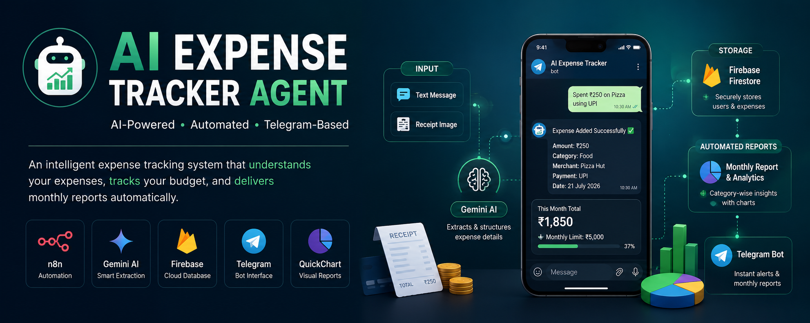
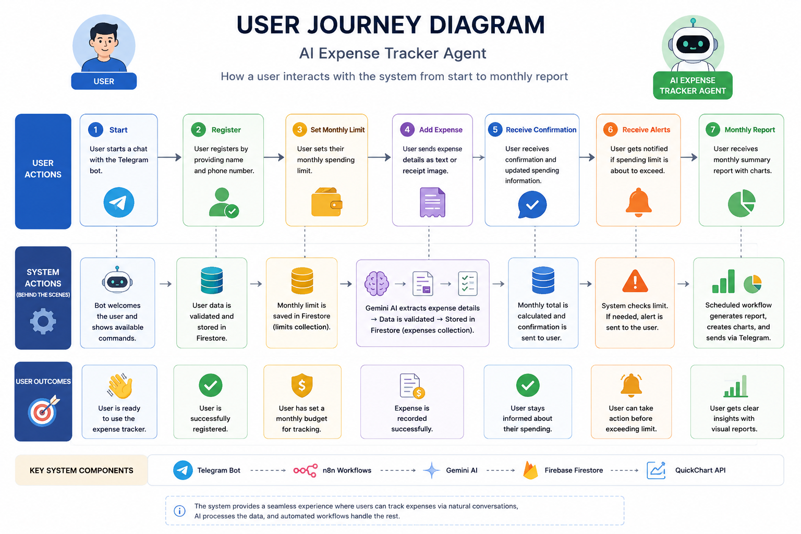
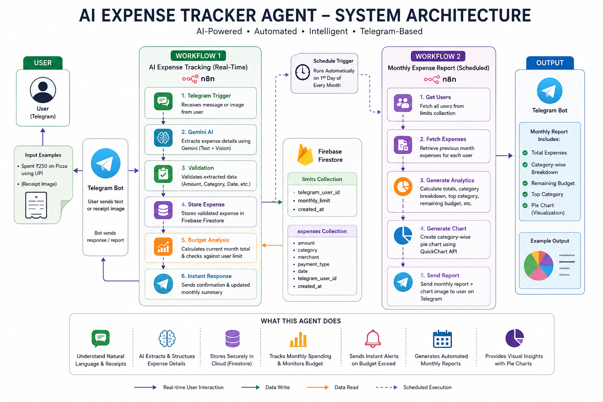
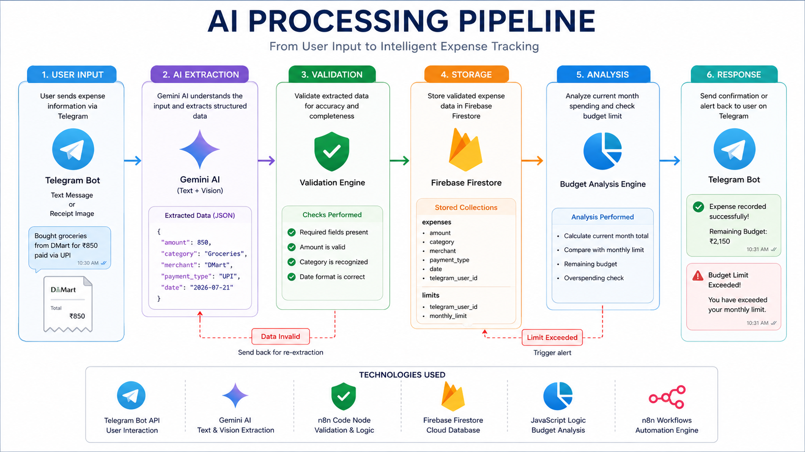
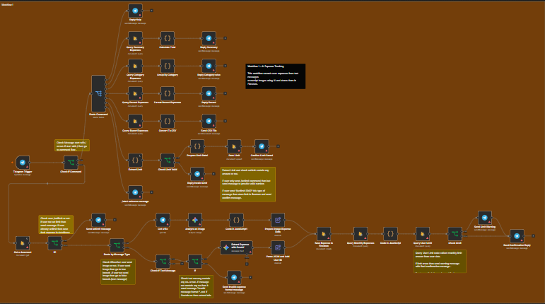
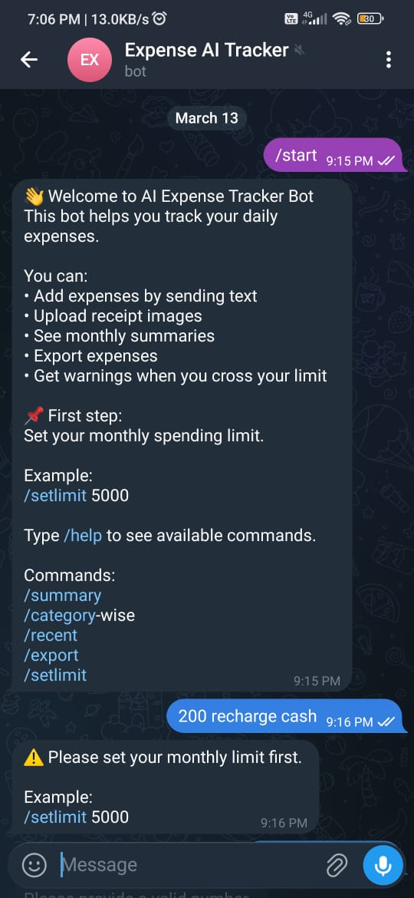
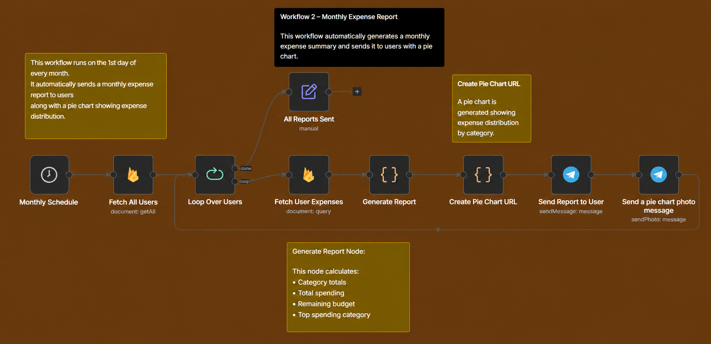
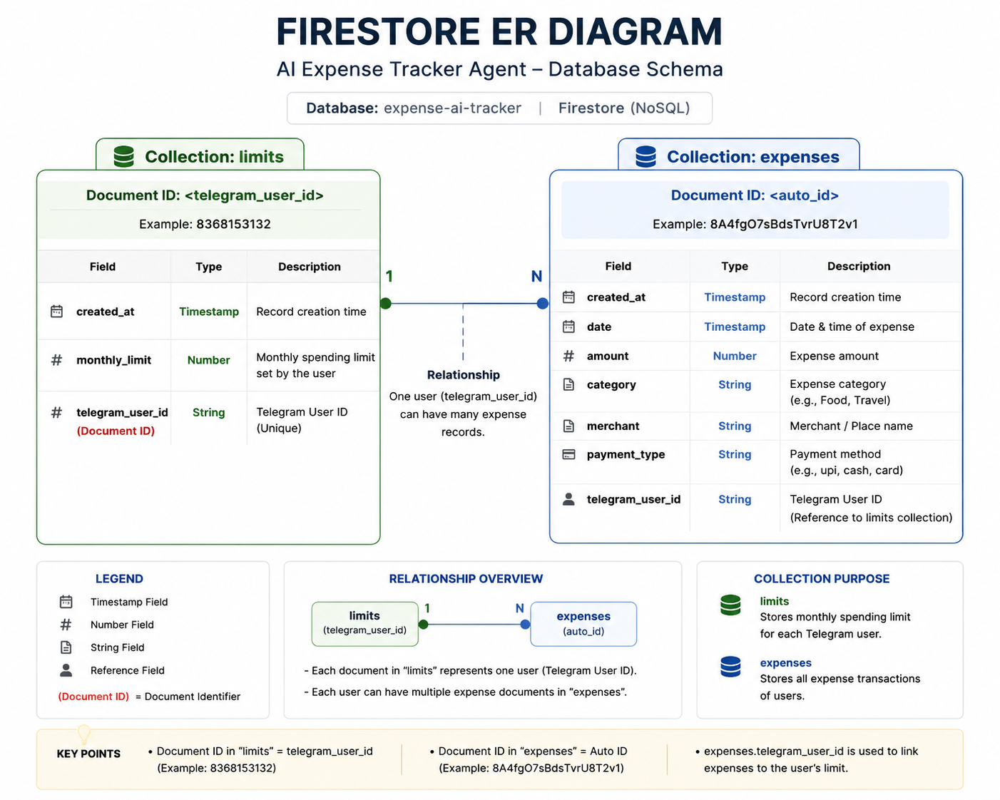
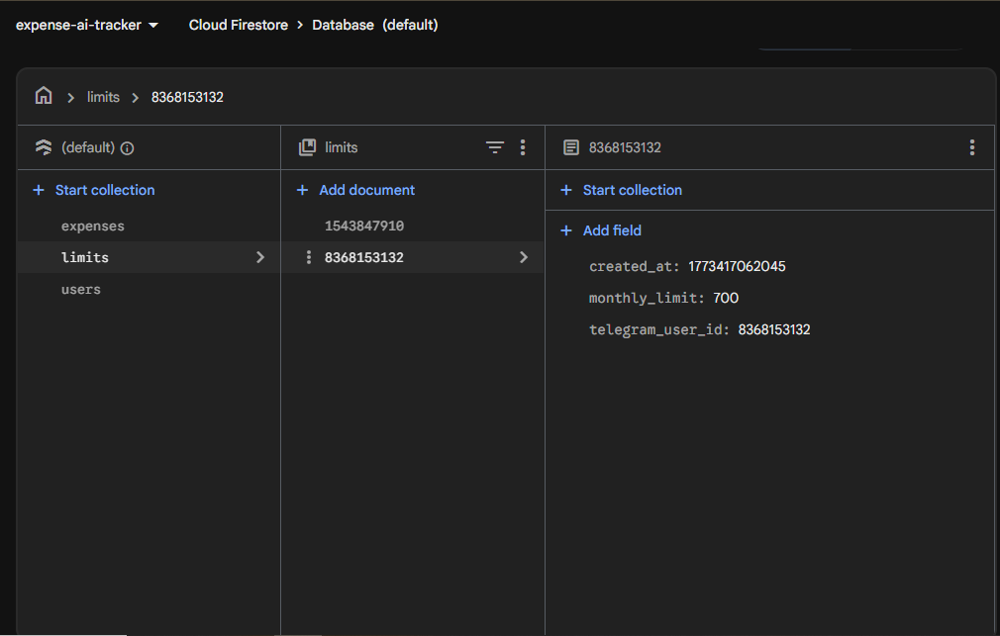
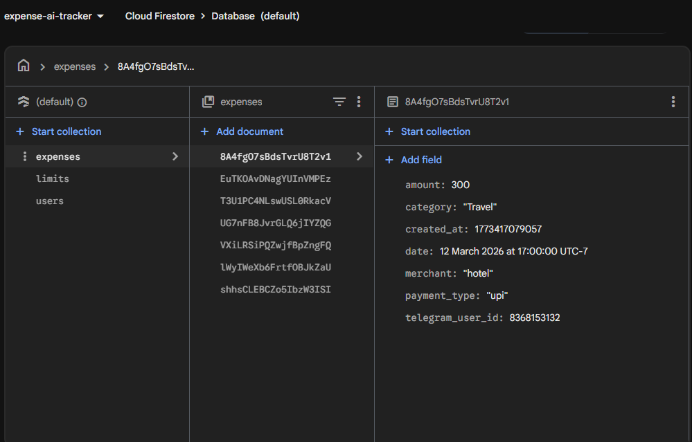

# AI Expense Tracker Agent

> An AI-powered personal finance assistant that understands natural language and receipt images to automatically track expenses, monitor monthly budgets, and deliver intelligent monthly spending reports through Telegram.

<p align="center">
  
  
  
  
</p>

<p align="center">
  
  
</p>

---

<p align="center">
  
</p>

---

## 📑 Table of Contents

- [Overview](#overview)
- [Key Features](#key-features)
- [Technology Stack](#technology-stack)
- [System Architecture](#system-architecture)
- [Workflow 1 — AI Expense Tracking](#workflow-1--ai-expense-tracking)
- [Workflow 2 — Monthly Expense Report](#workflow-2--monthly-expense-report)
- [Database Design](#database-design)
- [Database Relationship](#database-relationship)
- [Why This Database Design?](#why-this-database-design)
- [Why This Architecture?](#why-this-architecture)
- [Design Decisions](#design-decisions)
- [Challenges & Solutions](#challenges--solutions)
- [Project Highlights](#project-highlights)
- [Future Improvements](#future-improvements)
- [Repository Structure](#repository-structure)
- [Acknowledgements](#acknowledgements)
- [License](#license)
- [Author](#author)

---

## Overview

Managing personal expenses often requires manually entering transaction details into finance applications, making the process time-consuming and easy to ignore. This project removes that friction by allowing users to record expenses directly through Telegram using natural language or receipt images.

The system uses **Gemini AI** to extract structured expense information, validates the extracted data, stores every transaction in **Firebase Firestore**, continuously tracks monthly spending against the user's configured budget, and immediately sends confirmation with the updated monthly total.

A second automated workflow runs on the first day of every month to analyze the previous month's expenses, calculate spending insights, generate a category-wise pie chart using **QuickChart**, and deliver a complete expense report directly to the user's Telegram chat.

The entire solution is powered by **two automated n8n workflows**, providing an end-to-end AI expense tracking experience without requiring users to manually fill forms or manage spreadsheets.

---

## User Journey

The following diagram illustrates the complete user experience from registration to receiving automated monthly reports.

<p align="center">
  
</p>

---

## Key Features

- **Natural Language Expense Tracking**
  - Record expenses by sending simple text messages such as *"Spent ₹250 on Pizza using UPI"* without filling forms.

- **AI Receipt Processing**
  - Upload payment receipts or transaction screenshots, and Gemini AI automatically extracts expense details.

- **Intelligent Data Extraction**
  - Automatically identifies the amount, category, merchant, payment method, and transaction date from unstructured input.

- **Monthly Budget Management**
  - Users configure a monthly spending limit, which is continuously monitored after every expense.

- **Real-Time Budget Alerts**
  - Instantly notifies users whenever their monthly spending exceeds the configured budget.

- **Automatic Expense Categorization**
  - Expenses are organized into categories such as Food, Travel, Shopping, Medical, Recharge, Groceries, and more.

- **Firebase Firestore Integration**
  - Securely stores user information and expense records in separate Firestore collections for efficient querying and reporting.

- **Telegram-Based User Experience**
  - All interactions—including expense logging, summaries, reports, and notifications—take place directly inside Telegram without requiring a separate application.

- **Monthly Expense Analytics**
  - Automatically generates a detailed expense report on the first day of every month.

- **Category-wise Spending Breakdown**
  - Calculates total spending for each expense category to help users understand spending habits.

- **Remaining Budget Calculation**
  - Displays how much of the monthly budget remains after all recorded expenses.

- **Top Spending Category Detection**
  - Identifies the category with the highest expenditure during the reporting period.

- **Automatic Pie Chart Visualization**
  - Generates a category-wise spending distribution chart using QuickChart and delivers it directly through Telegram.

- **Scheduled Workflow Automation**
  - Monthly reports are generated automatically using n8n Schedule Trigger without requiring any user interaction.

- **Data Validation Layer**
  - Validates extracted information before saving to prevent incomplete or invalid expense records.

- **Command-Based Expense Management**
  - Supports built-in Telegram commands including:
  - `/start`
  - `/help`
  - `/setlimit`
  - `/summary`
  - `/category-wise`
  - `/recent`
  - `/export`

- **Dual Workflow Architecture**
  - Separates real-time expense tracking from scheduled monthly reporting, resulting in a modular and maintainable automation system.
  - 
---

## Technology Stack

| Category | Technology | Purpose |
|----------|------------|---------|
| **Workflow Automation** | n8n | Orchestrates the complete automation pipeline, manages workflow execution, integrates external services, and handles scheduled tasks. |
| **Artificial Intelligence** | Gemini AI | Extracts structured expense information from natural language text and receipt images. |
| **Database** | Firebase Firestore | Stores user profiles, monthly budget limits, and expense transactions in a scalable NoSQL database. |
| **Messaging Platform** | Telegram Bot | Provides a conversational interface for expense tracking, notifications, and monthly reports. |
| **Chart Generation** | QuickChart API | Generates dynamic pie charts for category-wise expense visualization without requiring a dedicated charting service. |
| **Programming Language** | JavaScript | Implements custom business logic, data validation, expense calculations, and report generation inside n8n Code nodes. |

---

## System Architecture

The project is built around two independent n8n workflows that together create a fully automated AI-powered expense tracking system.

- **Workflow 1 – AI Expense Tracking**
  - Handles all real-time user interactions through Telegram.
  - Extracts expense information using Gemini AI.
  - Validates the extracted data.
  - Stores expense records in Firebase Firestore.
  - Calculates the user's current monthly spending.
  - Checks the configured monthly budget.
  - Sends instant confirmations and budget warnings.

- **Workflow 2 – Monthly Expense Report**
  - Executes automatically on the first day of every month.
  - Retrieves all registered users.
  - Fetches each user's previous month's expenses.
  - Generates spending analytics and category-wise summaries.
  - Creates a pie chart using QuickChart.
  - Delivers the complete expense report directly to Telegram.
 
---

<p align="center">
    
</p>

---

### Architecture Highlights

- Two independent workflows separate real-time processing from scheduled reporting.
- Telegram serves as the complete user interface, eliminating the need for a web or mobile application.
- Gemini AI supports both text-based and image-based expense extraction.
- Firestore maintains separate collections for user settings and expense records, improving scalability and query performance.
- Monthly analytics and chart generation are fully automated through scheduled workflow execution.
- Modular workflow design allows each component to be maintained and extended independently.

<p align="right">
  <a href="#ai-expense-tracker-agent">⬆ Back to Top</a>
</p>

---

## Workflow 1 — AI Expense Tracking

The first workflow handles all real-time user interactions. It receives messages from Telegram, understands both natural language and receipt images using Gemini AI, validates the extracted information, stores expenses in Firebase Firestore, calculates monthly spending, and instantly responds with an updated expense summary.

---

<p align="center">
  
</p>

---

## Workflow 1

<p align="center">
    
</p>


---

### Step 1 — User Registration

The workflow begins whenever a user sends a message to the Telegram bot.

For first-time users, the bot displays a welcome message introducing the available commands and guides the user to configure a monthly spending limit before recording expenses.

Supported commands include:

- `/start`
- `/help`
- `/setlimit`
- `/summary`
- `/category-wise`
- `/recent`
- `/export`


<p align="center">
    
</p>

---

### Step 2 — Monthly Budget Configuration

Before recording any expenses, users must define their monthly spending limit.

Example:

```text
/setlimit 5000
```

The configured budget is stored in the **limits** collection inside Firebase Firestore and is later used for budget monitoring and monthly report generation.

If a user attempts to record an expense before setting a limit, the workflow prevents further processing and requests budget configuration first.

<p align="center">
    
</p>

---

### Step 3 — Expense Input

Once the monthly budget has been configured, users can record expenses using either of the following methods.

**Natural Language**

```text
Spent ₹250 on Pizza using UPI

Paid ₹1200 to Amazon by Credit Card

Recharge ₹399 using PhonePe
```

**Receipt Images**

Users can also upload payment receipts or transaction screenshots.

Gemini AI analyzes the image and extracts the required expense information automatically.

<p align="center">
    
</p>

---

### Step 4 — AI Information Extraction

Gemini AI converts unstructured text or receipt images into structured expense data.

The extracted information includes:

| Field | Description |
|--------|-------------|
| Amount | Transaction amount |
| Category | Expense category |
| Merchant | Store or service name |
| Payment Type | UPI, Cash, Credit Card, etc. |
| Date | Transaction date |

Example:

| Field | Value |
|--------|-------|
| Amount | ₹250 |
| Category | Food |
| Merchant | Pizza Hut |
| Payment Type | UPI |
| Date | 21 July 2026 |

---

### Step 5 — Data Validation

Before storing the expense, the workflow validates the extracted information.

Validation checks include:

- Amount exists
- Category exists
- Merchant exists
- Monthly limit configured
- Valid Telegram user
- Valid transaction data

If any required information is missing, the expense is rejected and the user is asked to submit it again.

---

### Step 6 — Store Expense

After successful validation, the expense is stored in the **expenses** collection inside Firebase Firestore.

Each transaction contains:

- Amount
- Category
- Merchant
- Payment Type
- Date
- Telegram User ID
- Created Timestamp

---

### Step 7 — Monthly Spending Analysis

Immediately after storing the expense, the workflow calculates the user's total spending for the current month.

This running total is used to:

- Update monthly spending
- Compare against the configured budget
- Trigger budget warnings when necessary

---

### Step 8 — Budget Monitoring

If the monthly spending exceeds the configured limit, the workflow immediately notifies the user.

Example:

```text
⚠️ Warning!

You crossed your monthly spending limit.

Limit: ₹5000
Spent: ₹5420
```

The expense is still recorded to maintain accurate financial history.

---

### Step 9 — Confirmation Response

For every successfully recorded expense, the bot sends an instant confirmation containing the latest spending information.

Example:

```text
₹250 added successfully.

Category: Food

This Month Total: ₹1850
```

This provides immediate feedback while keeping users informed about their current monthly spending.

<p align="center">
    
</p>

<p align="right">
  <a href="#ai-expense-tracker-agent">⬆ Back to Top</a>
</p>

---

## Workflow 2 — Monthly Expense Report

The second workflow is a fully automated reporting system that runs on a scheduled basis. It analyzes each registered user's previous month's expenses, generates spending insights, creates a category-wise pie chart, and delivers a personalized monthly report directly to Telegram.

---

<p align="center">
    
</p>

---

### Workflow Overview

```text
Schedule Trigger
(1st Day of Every Month)
            │
            ▼
Retrieve Registered Users
(Firestore - limits)
            │
            ▼
Process Each User
            │
            ▼
Fetch Previous Month Expenses
            │
            ▼
Generate Spending Analytics
            │
            ▼
Create Pie Chart
(QuickChart API)
            │
            ▼
Send Expense Report
            │
            ▼
Send Pie Chart to Telegram
```

---

### Step 1 — Scheduled Execution

The workflow is triggered automatically using the **n8n Schedule Trigger**.

**Schedule**

- Frequency: Monthly
- Day: 1st
- Time: 09:00 AM

No user interaction is required. The reporting process starts automatically every month.

---

### Step 2 — Retrieve Registered Users

The workflow retrieves all registered users from the **limits** collection in Firebase Firestore.

Each document contains:

- Telegram User ID
- Monthly Budget
- Account Creation Date

These records determine who should receive the monthly expense report.

---

### Step 3 — Process Users Individually

Instead of processing all users together, the workflow iterates through each registered user one at a time.

This ensures:

- Personalized reports
- Independent expense calculations
- Accurate budget comparisons
- Scalable report generation for multiple users

---

### Step 4 — Fetch Previous Month Expenses

For every user, the workflow queries the **expenses** collection to retrieve only the transactions belonging to the previous calendar month.

For example:

| Report Date | Expense Period |
|-------------|----------------|
| 1 April | 1 March – 31 March |
| 1 August | 1 July – 31 July |
| 1 January | 1 December – 31 December |

Only expenses matching both the **Telegram User ID** and the **previous month's date range** are included in the report.

---

### Step 5 — Generate Monthly Analytics

A JavaScript Code node processes the retrieved expense records and calculates meaningful financial insights.

Generated analytics include:

- Total Monthly Spending
- Category-wise Expense Breakdown
- Remaining Monthly Budget
- Highest Spending Category
- Total Number of Transactions

These calculations transform raw expense data into an easy-to-understand monthly financial summary.

---

### Step 6 — Generate Category-wise Pie Chart

The calculated category totals are converted into a **QuickChart API** request.

QuickChart dynamically generates a pie chart that visualizes how the user's spending is distributed across different categories.

Example categories:

- Food
- Shopping
- Travel
- Medical
- Recharge
- Entertainment
- Groceries

This visualization helps users quickly identify where most of their money was spent during the month.

---

### Step 7 — Deliver Monthly Report

Once all calculations are complete, the workflow sends a personalized expense summary directly to the user's Telegram chat.

The report includes:

- Reporting Month
- Total Expenses
- Monthly Budget
- Remaining Budget
- Top Spending Category
- Category-wise Spending Summary

Example:

```text
📊 Monthly Expense Report

Month: July 2026

Total Spent: ₹8,450

Monthly Limit: ₹10,000

Remaining Budget: ₹1,550

Top Category: Food

Category Breakdown

• Food - ₹3,200
• Shopping - ₹2,100
• Travel - ₹1,450
• Recharge - ₹900
• Others - ₹800
```

---

### Step 8 — Send Spending Visualization

After the summary message is delivered, the workflow sends the generated pie chart as a Telegram image.

The visualization provides an immediate overview of spending distribution, making it easier for users to understand their monthly financial habits without reading detailed tables.

---

### Workflow Highlights

- Fully automated monthly execution
- No manual user interaction required
- Processes every registered user independently
- Analyzes only the previous month's expenses
- Generates personalized spending insights
- Calculates category-wise analytics
- Detects the highest spending category
- Creates dynamic pie charts using QuickChart
- Delivers reports directly through Telegram
- Built as an independent workflow for improved scalability and maintainability

<p align="right">
  <a href="#ai-expense-tracker-agent">⬆ Back to Top</a>
</p>

---

## Database Design

The project uses **Firebase Firestore** as its cloud-hosted NoSQL database. Data is organized into separate collections based on responsibility, making the system modular, scalable, and easy to maintain.

Two primary collections power the application:

- **limits** – Stores user-specific monthly budget information.
- **expenses** – Stores every expense transaction recorded by users.

Separating user configuration from transactional data simplifies querying, reporting, and future feature expansion.

---

<p align="center">
    
</p>

---

### Collection: `limits`

This collection maintains each registered user's monthly spending configuration.

| Field | Type | Description |
|--------|------|-------------|
| `telegram_user_id` | String | Unique identifier of the Telegram user. |
| `monthly_limit` | Number | User's configured monthly spending budget. |
| `created_at` | Timestamp | Date and time when the limit was created. |

#### Purpose

- Register users
- Store monthly spending limits
- Identify users during scheduled report generation
- Compare monthly spending against the configured budget

<p align="center">
    
</p>

---

### Collection: `expenses`

Every expense recorded by the AI agent is stored as an individual document inside the **expenses** collection.

| Field | Type | Description |
|--------|------|-------------|
| `amount` | Number | Expense amount. |
| `category` | String | Expense category identified by AI. |
| `merchant` | String | Merchant or business name. |
| `payment_type` | String | Payment method (UPI, Cash, Credit Card, etc.). |
| `date` | Date | Transaction date. |
| `telegram_user_id` | String | Owner of the expense record. |
| `created_at` | Timestamp | Date and time the record was stored. |

#### Purpose

- Store every expense transaction
- Maintain complete expense history
- Calculate monthly spending
- Generate category-wise analytics
- Produce monthly reports
- Generate spending visualizations

<p align="center">
    
</p>


<p align="right">
  <a href="#ai-expense-tracker-agent">⬆ Back to Top</a>
</p>

---

## Why This Database Design?

The Firestore schema was intentionally designed to separate **user configuration** from **transactional data**.

### Benefits

- Clean separation of user settings and expense records
- Faster user lookup during workflow execution
- Efficient monthly report generation
- Simplified querying using `telegram_user_id`
- Easy scalability for thousands of expense documents
- Flexible schema for adding future fields without database migrations
- Optimized for independent read and write operations across both workflows

This structure enables the AI Expense Tracker Agent to perform real-time expense tracking while efficiently generating monthly analytics without mixing user preferences with transactional records.


<p align="right">
  <a href="#ai-expense-tracker-agent">⬆ Back to Top</a>
</p>

---

## Why This Architecture?

Every technology used in this project was selected to solve a specific problem while keeping the system modular, scalable, and easy to maintain.

| Technology | Why It Was Chosen |
|------------|-------------------|
| **n8n** | Serves as the workflow orchestration platform, enabling visual automation, seamless integrations, scheduled execution, and custom business logic without building a backend server. |
| **Gemini AI** | Extracts structured expense information from both natural language and receipt images, allowing users to record expenses without manually filling forms. |
| **Firebase Firestore** | Provides a scalable, cloud-hosted NoSQL database capable of storing user settings and expense transactions with flexible document-based storage. |
| **Telegram Bot** | Acts as the complete user interface, allowing users to interact with the system through a familiar messaging application without installing a separate app. |
| **QuickChart API** | Dynamically generates pie chart visualizations from category-wise expense data without requiring a dedicated charting library or frontend dashboard. |
| **JavaScript Code Nodes** | Implements custom business logic including validation, monthly calculations, budget analysis, report generation, and chart data preparation directly inside n8n workflows. |


<p align="right">
  <a href="#ai-expense-tracker-agent">⬆ Back to Top</a>
</p>

---

## Design Decisions

Several architectural decisions were intentionally made during development to improve usability, maintainability, and long-term scalability.

### Monthly Budget First

Users must configure a monthly spending limit before recording any expenses.

This ensures every recorded transaction can immediately be compared against a defined budget, enabling real-time spending analysis and budget alerts.

---

### Separate Firestore Collections

User configuration and expense transactions are stored in different Firestore collections.

This separation improves query performance, simplifies report generation, and keeps user settings independent from transactional data.

---

### AI-Based Data Extraction

Instead of asking users to complete structured forms, Gemini AI converts unstructured text and receipt images into structured expense records.

This significantly reduces manual effort while creating a more natural user experience.

---

### Dual Workflow Architecture

The system is divided into two independent workflows.

- Workflow 1 focuses on real-time expense tracking.
- Workflow 2 focuses on scheduled monthly reporting.

Separating responsibilities makes the workflows easier to understand, maintain, and extend.

---

### Previous Month Reporting

Monthly reports analyze only the previous calendar month's expenses instead of the user's entire expense history.

This provides meaningful monthly insights while preventing historical data from affecting current reports.

---

### Automated Reporting

Expense reports are generated automatically using n8n's Schedule Trigger.

Users never need to request reports manually, ensuring consistent monthly financial summaries.

---

### Chart Generation Without Frontend

QuickChart generates visual spending summaries directly from expense data.

This removes the need to build and maintain a separate reporting dashboard while still providing clear graphical insights.

---

### Real-Time Budget Monitoring

Budget validation occurs immediately after every expense is recorded.

Users receive instant feedback whenever they exceed their configured monthly spending limit, helping them stay aware of their financial habits.


<p align="right">
  <a href="#ai-expense-tracker-agent">⬆ Back to Top</a>
</p>

---

## Challenges & Solutions

Building an AI-powered expense tracking system required solving several practical challenges involving AI extraction, workflow automation, data validation, and reporting.

| Challenge | Solution |
|-----------|----------|
| Users may submit incomplete or ambiguous expense descriptions. | Added a validation layer to verify required fields before storing transactions. Invalid data is rejected and the user is prompted to submit the expense again. |
| Expense records can originate from both text messages and receipt images. | Created separate processing paths while producing a unified structured output before database storage. |
| Budget monitoring must remain accurate after every transaction. | Recalculate the current month's total immediately after storing each expense instead of relying on cached values. |
| Monthly reports should not include historical transactions. | Queries filter expenses using both the Telegram user ID and the previous month's date range. |
| Multiple users need independent reports during scheduled execution. | Iterate through registered users one by one, generating personalized analytics for each account. |
| Visual spending insights are required without developing a frontend dashboard. | Integrated QuickChart API to generate category-wise pie charts dynamically from workflow data. |
| User settings and transaction history require different access patterns. | Designed separate Firestore collections for configuration data and transactional records to improve maintainability and scalability. |

<p align="right">
  <a href="#ai-expense-tracker-agent">⬆ Back to Top</a>
</p>

---

## Project Highlights

- AI-powered expense tracking using natural language and receipt images
- Fully automated workflow built with n8n
- Real-time expense extraction using Gemini AI
- Intelligent validation before database storage
- Firebase Firestore integration for scalable data management
- Monthly budget monitoring with instant warning notifications
- Automatic monthly expense reports
- Category-wise spending analytics
- Dynamic pie chart generation using QuickChart
- Telegram-based conversational user experience
- Modular dual-workflow architecture
- Scheduled reporting with zero manual intervention
- Clean and scalable Firestore database design

---

## Future Improvements

The current implementation establishes a strong foundation for AI-powered personal finance management. Several enhancements can further improve the user experience and analytical capabilities.

### Planned Features

- Weekly expense reports
- Daily spending reminders
- Custom expense categories
- Voice-based expense logging
- Multi-language support
- Multi-currency support
- PDF report generation
- Spending trend analysis
- Budget prediction using AI
- Recurring expense detection
- Merchant-wise analytics
- Export reports in Excel format
- Interactive web dashboard
- Mobile application integration
- Advanced financial insights powered by AI

<p align="right">
  <a href="#ai-expense-tracker-agent">⬆ Back to Top</a>
</p>

---

## Repository Structure

```text
AI-EXPENSE-TRACKER-AGENT/
│
├── assets/
│   ├── ai-processing-pipeline.png
│   ├── architecture.png
│   ├── banner.png
│   ├── firebase-expenses.png
│   ├── firebase-limit.png
│   ├── firestore-er-diagram.png      (Pending)
│   ├── telegram-demo-1.jpeg
│   ├── telegram-demo-2.jpeg
│   ├── telegram-demo-3.jpeg
│   ├── telegram-demo-4.png
│   ├── user-journey-diagram.png      (Pending)
│   ├── workflow-1.png
│   └── workflow-2.png
│
├── docs/
│   ├── ARCHITECTURE.md
│   ├── DATABASE.md
│   └── SYSTEM-DESIGN.md
│
├── index.html
├── LICENSE
└── README.md
```

---

## Acknowledgements

This project combines several modern technologies to create a practical AI automation solution for personal expense management.

Special thanks to the teams behind the following technologies:

- **n8n** for workflow automation
- **Google Gemini AI** for intelligent text and image understanding
- **Firebase Firestore** for scalable cloud database services
- **Telegram Bot API** for conversational interactions
- **QuickChart** for dynamic chart generation

Their platforms made it possible to build an end-to-end AI-powered expense tracking system without developing a traditional backend application.

---

## License

This project is licensed under the **MIT License**.

You are free to use, modify, and distribute this project in accordance with the terms of the license.

---

## Author

**Saurabh A. Patil**

AI Automation Engineer | Generative AI Enthusiast

- GitHub: https://github.com/saurabhpatil67
- LinkedIn: www.linkedin.com/in/saurabhpatil-ai

---

<div align="center">

### If you found this project helpful, consider giving it a ⭐ on GitHub.

It helps others discover the project and motivates future improvements.

</div>

---
